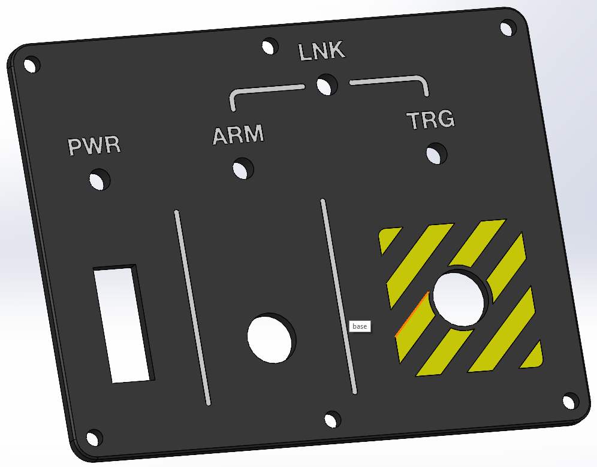
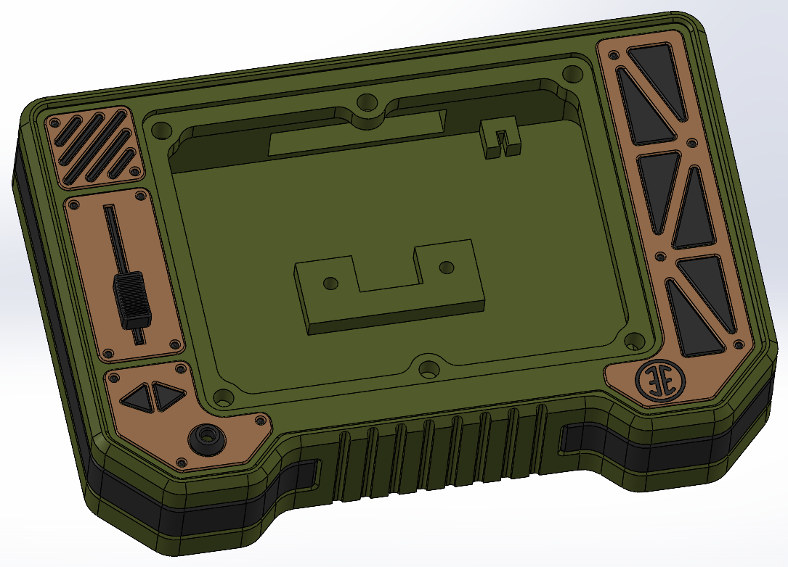
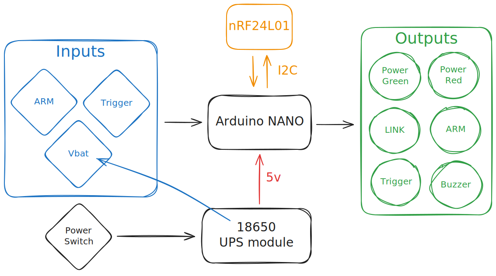
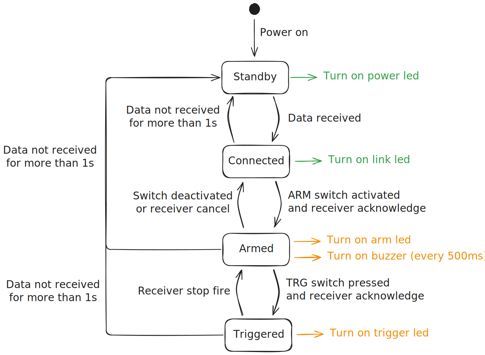

# Arduino remote
This is a remote using an arduino nano board and an nRF24L01 radio module to trigger stuff from a distance.

# Hardware
- 1x arduino nano board
- 1x nRF24L01 radio module
- 1x 5v 18650 UPS module
- 1x 5mm frosted flat top green led
- 2x 5mm frosted flat top amber led
- 2x 5mm frosted flat top RGB led
- 1x rectangular toggle switch (30x14mm)
- 1x lever toggle switch with safety cover
- 1x 12mm switch
- 1x 12mm 5v piezo buzzer
- 1x 100µF electrolytic capacitor
- 5x 100Ω resistors
- 1x >10KΩ resistor
- 2x M3 heat insert
- 2x M3x3mm rounded head screw
- 6x M4 head insert
- 6x M4x5mm rounded head screw
- wires
- perfboard

# 3D printing
All parts have been printed with multicolor for best results on a Prusa XL 5 tools.
If you dont have access to a multicolor printer, yoou can import all stl in your slicer and print with the same color.

## Front pannel
Printing time is about 1h on the default print speed.

## Enclosure
Printing time is about 6h on the default print speed with 3 perimiters, 8% infill and support enabled.

# Software
The following picture show the main components.

The various states and switches interaction are as follow.

